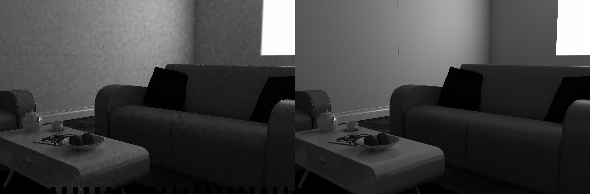
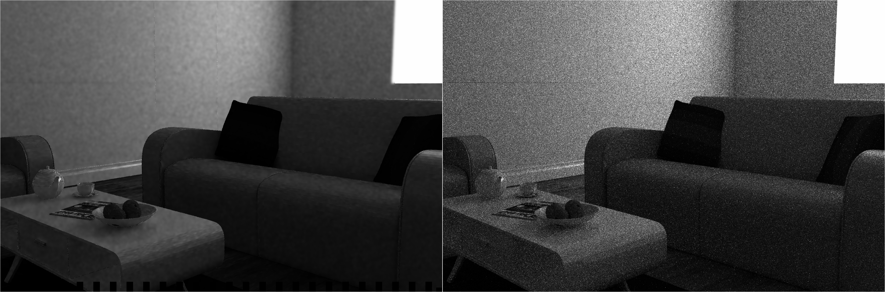

# experiment on the real data

Best result with manual weights are about : 0.00019636219035925

Obtain with 7 layers of guide

It takes 15 sec to compute the JBF on a image  1280*1920 with 7 guides.

```
Time elapsed : 15.00773191452 seconds	
```

* filtered vs ground truth



* filtered vs input

